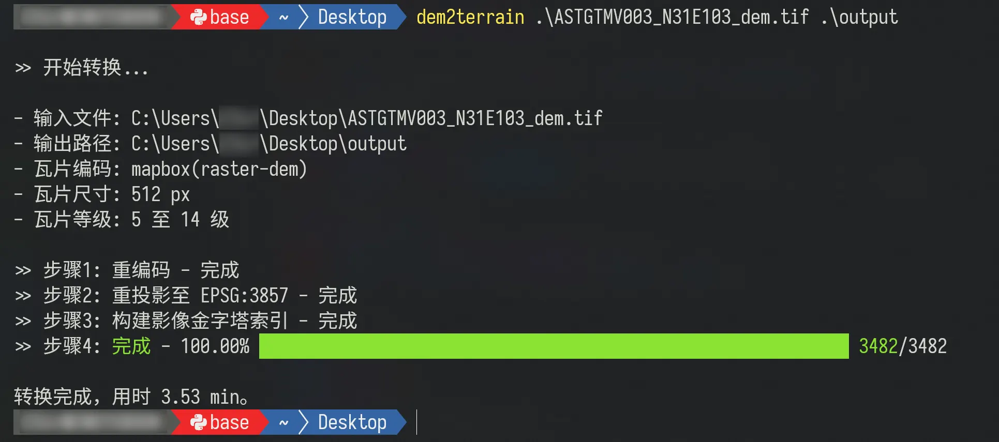
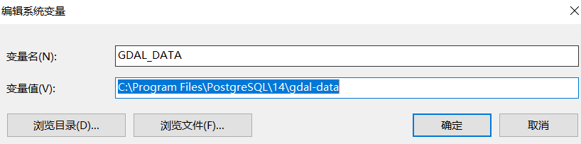
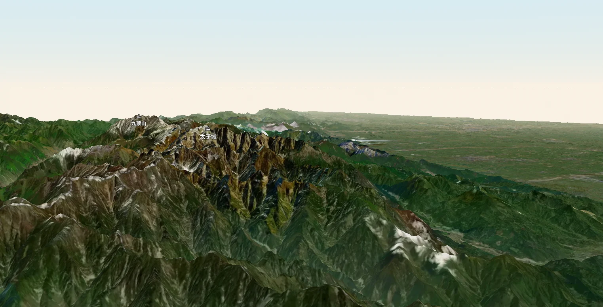

# 简介

根据 DEM 数据生成地形切片工具,使用 NodeJS + GDAL（NodeBinding）开发制作。可用于用户自定义 DEM 高程数据源生产地形瓦片，以便局域网离线使用。

特点：

- 支持 `mapbox` 和 `terrarium` 两种地形瓦片编码格式；
- 支持自定义瓦片级别和瓦片尺寸设置，瓦片周围会有 1px 的裙边。例如指定生成 512px 的瓦片，实际输出的瓦片文件分辨率为 `514 × 514`，与 Mapbox 官方一致；
- 自动读取数据源的坐标系统，重编码输入的 DEM 栅格文件，并重投影至 `EPSG:3857`（Web 墨卡托），然后生成瓦片；
- 内置了影像金字塔索引和多进程实现（暂未使用多线程），加速瓦片生成速度；
- 命令行提供了瓦片生成的进图条提示，便于用户查看生成进度。



> 注意：该工具目前仅生成 png 格式的地形瓦片，用户通过第三方工具将 png 转 webp 时，压缩会导致地形的数据紊乱从而可视化异常。计划用 GDAL webp-driver 改进这一点。

# 1. 安装与配置

## 1.1. 安装

从网络全局安装，成为命令行工具：

```bash
npm i dem2terrain -g
yarn add dem2terrain -g
pnpm add dem2terrain -g
```

源码安装（先将当前目录定位至工程根目录，且明白什么是 link 命令）：

```bash
npm install && npm link
# 或
yarn && yarn link
# 或
pnpm install && pnpm link --global
```

安装完毕后就可以当普通命令行程序使用了。

## 1.2. 配置 GDAL_DATA

由于使用了 GDAL，用户需要 [下载 gdal-data.zip](./third-party/gdal-data.zip) 数据包，并配置 `GDAL_DATA` 环境变量为解压缩的目录。

以 Windows 操作系统为例（此例直接使用 PostgreSQL 附带的资源，若用户有安装 PostgreSQL，也可以直接使用对应目录）：



# 2. 用法与说明

当前支持作为命令行使用：

```plaintext
> dem2terrain --help
Usage: dem2terrain [options] <input-tiff-file> <output-directory>

使用 GDAL 制作地形瓦片，支持 mapbox 和 terrarium 两种编码输出格式，当前仅输出 PNG 容器格式。

Arguments:
  input-tiff-file             输入 tif 格式的 DEM 文件路径，支持相对路径
  output-directory            输出目录，支持相对路径

Options:
  -v, --version               当前版本
  -s, --size <number>         指定生成瓦片的尺寸（256 或 512）| 默认 512 像素
  -z, --zoom <number-number>  指定瓦片的等级生成范围。例如，想生成 7 ~ 12 级的瓦片，则输入 -z 7-12 | 默认值是 -z 5-14
  -e, --encoding <string>     指定瓦片的数据编码规则（mapbox 或 terrarium）| 默认 -e mapbox
  -h, --help                  帮助
```

可选参数说明：

- `-z`: 由于地形栅格数据通常是 90m、30m 的空间分辨率，等级太大意义不大，等级太低时起伏辨识也不高，所以默认生成中间的 `5-14` 级；
- `-s`: 指定输出瓦片的尺寸，默认是 512 像素；
- `-e`: 指定切片编码规则，默认 mapbox，用户可指定 terrarium 规则输出。

举例：

```bash
dem2terrain -z 4-15 -s 256 -e terrarium ./ZONE.tiff ./output
```

# 3. 使用输出成果

使用 HTTP(S) 协议的 Web 服务器（例如 `nginx`、`IIS`）将生成的地形瓦片作为静态资源发布，即可使用。

举例：根据 [MapboxGL 地形示例](https://docs.mapbox.com/mapbox-gl-js/example/add-terrain/) 简单修改，将在线数据源换成本地 Web 服务器发布的地址即可，注意编码格式要与生成时输入的编码格式一致。

```javascript
// 数据编码，'mapbox'或'terrarium'
const encoding = 'mapbox';
const tileSize = 512;
const maxZoom = 14;
map.addSource('my-custom-terrain', {
  type: 'raster-dem',
  encoding:encoding,
  // 也可以使用tiles方式
  //tiles: ['./mapbox/{z}/{x}/{y}.png'],
  // 注释掉官方的服务url，替换自己的
   url: 'path/to/your/terrain_tiles',
	//'url': 'mapbox://mapbox.mapbox-terrain-dem-v1',
  tileSize: tileSize,
  maxzoom: maxZoom,
})
```

如下图所示：



# 4. TODO

当前版本足够 MapboxGL.js 使用，但仍然有新功能未开发，留待以后扩展功能，初步拟定待扩展功能如下：

- 扩展 gdal 驱动，使其支持 webp，直接生成 webp 格式的切片
- 重构核心模块，解耦，扩展使其支持生成 CesiumJS 支持的地形切片格式
- 重构核心模块解耦数据输出模块，升级支持生成 mbtiles
- 重构坐标系换算模块，支持生成自定义坐标系的瓦片，例如 `EPSG:4490` 和 `wgs-geodesic` 等

欢迎参与贡献，包括但不限于文档、功能扩展、性能优化！

# 5. 知识补充

## 5.1. 参考资料

- [GitHub - tilezen/joerd - terrarium](https://github.com/tilezen/joerd/blob/master/docs/formats.md#terrarium)

- [MapboxDocs - raster-dem](https://docs.mapbox.com/data/tilesets/reference/mapbox-terrain-dem-v1/)

## 5.2. 编解码差异

`mapbox` 和 `terrarium` 都将高程值编码成 RGB 数组存储，下面以简单的编解码函数说明两种编码格式的差异。

MapboxGL：

```typescript
function mapboxEncode(height: number) {
  const value = Math.floor((height + 10000) * 10);
  const r = value >> 16;
  const g = value >> 8 & 0x0000FF;
  const b = value & 0x0000FF;
  return [r, g, b];
}

function mapboxDecode(
  color: [number, number, number]
) {
  return -10000 + ((color[0] * 256 * 256 + color[1] * 256 + color[2]) * 0.1);
}
```

terrarium：

```typescript
function terrariumEncode(height: number) {
  height += 32768;
  const r = Math.floor(height / 256.0);
  const g = Math.floor(height % 256);
  const b = Math.floor((height - Math.floor(height)) * 256.0);
  return [r, g, b];
}

function terrariumDecode(
  color: [number, number, number]
) {
  return (color[0] * 256 + color[1] + color[2] / 256.0) - 32768;
}
```

对于 cesium 的地形编码和解码：

```typescript
// 每个点像素值是 int16
function cesiumEncode(height: number) {
  return Math.floor((height + 1000) / 0.2);
}

function cesiumDecode(pixel: number){
  return (pixel * 0.2) - 1000;
}
```
