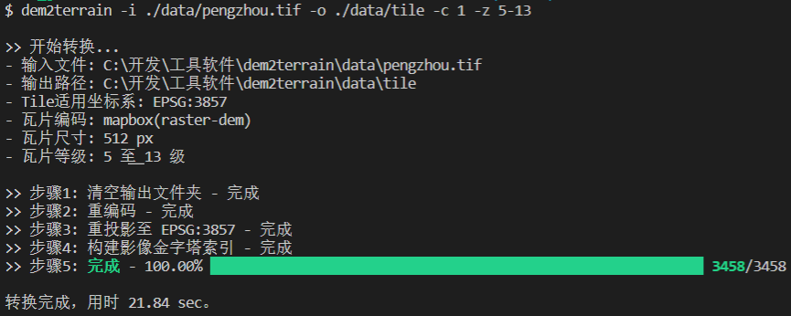
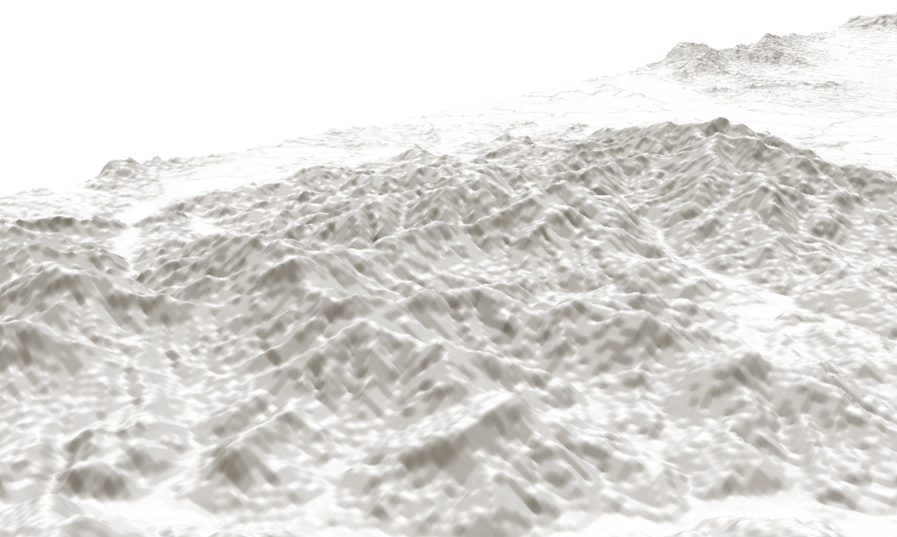

# 简介

根据 DEM 数据生成地形切片工具，使用 NodeJS + GDAL（NodeBinding）开发制作。可用于用户自定义 DEM 高程数据源生产地形瓦片，以便局域网离线使用。

特点：

- 支持 `mapbox` 和 `terrarium` 两种地形瓦片编码格式供mapboxgl使用，其中terrarium格式是[tangram](https://www.mapzen.com/products/tangram/)引擎的官方地形格式，tangram是另外一款开源的webgl二三维一体化的引擎；
- 支持自定义瓦片级别和瓦片尺寸设置，瓦片周围会有 1px 的裙边。例如指定生成 512px 的瓦片，实际输出的瓦片文件分辨率为 `514 × 514`，与 Mapbox 官方一致；
- 自动读取数据源的坐标系统，重编码输入的 DEM 栅格文件，并重投影至指定的坐标系4490、4326、3857，默认3857，然后生成瓦片；
- 支持适用于3857、4490、4326的地形切片生产；
- 内置了影像金字塔索引和多进程实现（暂未使用多线程），加速瓦片生成速度；
- 支持地形瓦片以文件目录或mbtiles两种格式存储；
- 命令行提供了瓦片生成的进图条提示，便于用户查看生成进度。
- 内置一些异常导致的临时文件清理工作。




# 1. 安装与配置

## 1.1. 配置 GDAL_DATA

由于使用了 GDAL，用户需要 [下载 gdal-data.zip](./third-party/gdal-data.zip) 数据包，并配置 `GDAL_DATA` 环境变量为解压缩的目录。

以 Windows 操作系统为例（此例直接使用 PostgreSQL 附带的资源，若用户有安装 PostgreSQL，也可以直接使用对应目录）：


## 1.2. 安装

从网络全局安装，成为命令行工具：

```bash
npm i dem2terrain -g
yarn add dem2terrain -g
pnpm add dem2terrain -g
```

源码安装（先将当前目录定位至工程根目录，且明白什么是 link 命令）：

```bash
npm install && npm link
# 或
yarn && yarn link
# 或
pnpm install && pnpm link --global
```

安装完毕后就可以当普通命令行程序使用了。

## 1.3. 测试
测试地形数据生产：
```bash
npm run test

```
基于maplibregl地形预览：

```bash
npm run server

```
浏览器输入地址进行预览：http://[ip]:[port]/terrain.html

效果图如下：



# 2. 用法与说明

当前支持作为命令行使用：

```plaintext
> dem2terrain --help
Usage: dem2terrain [options]

使用 GDAL 制作地形瓦片，支持 mapbox 和 terrarium 两种编码输出格式，当前仅输出 PNG 容器格式。

Options:
  -v, --version               当前版本
  -i, --input <string>        <必填> 输入 tif 格式的 DEM 文件路径，支持相对路径
  -o, --output <string>       <必填> 输出目录，支持相对路径
  -f, --configFile <File>     <可选> 通过配置文件执行任务，输入绝对路径，可参考配置模板
  -g, --epsg <number>         <可选> Tile适用坐标系，3857 | 4490 | 4326 (default: 3857)
  -c, --clean <number>        <可选> 是否清空输出目录，0 | 1 (default: 0)
  -s, --size <number>         <可选> 指定生成瓦片的尺寸,256 | 512 (default: 512)
  -z, --zoom <number-number>  <可选> 指定瓦片的等级生成范围。例如，想生成 7 ~ 12 级的瓦片，则输入 -z 7-12 (default: "5-14")
  -e, --encoding <string>     <可选> 指定瓦片的数据编码规则（mapbox 或 terrarium） (default: "mapbox")
  -h, --help                  帮助
```

可选参数说明：
- `-i`: 输入 tif 格式的 DEM 文件路径，支持相对路径；
- `-o`: 输出目录，支持相对路径；
- `-g`: 指定地形Tile适用坐标系，默认是适用3857坐标系；
- `-z`: 由于地形栅格数据通常是 90m、30m 的空间分辨率，等级太大意义不大，等级太低时起伏辨识也不高，所以默认生成中间的 `5-14` 级；
- `-s`: 指定输出瓦片的尺寸，默认是 512 像素；
- `-c`: 指定是否预先清理输出瓦片的存储目录，默认0，不清理；
- `-e`: 指定切片编码规则，默认 mapbox，用户可指定 terrarium 规则输出。
- `-f`: 以上参数可以都放到一个配置json文件里，使用-f执行切片任务，简化操作；

## 2.1 任务执行

有两种形式执行命令行任务

* 方式1：通过命令行参数执行任务
```bash
dem2terrain -z 4-15 -s 256 -e terrarium -i ./ZONE.tiff -o ./output -c 1 -g 3857
```

* 方式2：通过配置文件执行任务

1）配置参数
```
{
    "zoom":"5-13",
    "epsg": 3857,
    "size": 512,
    "encoding": "mapbox",
    "input": "./data/xxx.tif",
    "output": "./data/tile",
    "clean": true
}
```
2）执行任务
```bash
dem2terrain -f d://config.json
```

## 2.2 数据输出
支持地形切片生成以文件或mbtiles目录两种形式存储。

* 以文件存储

-o参数为文件目录，则以文件形式存储：
```bash
dem2terrain -z 4-15 -s 256 -e terrarium -i ./ZONE.tiff -o ./output -c 1 -g 3857
```

* 以mbtiles存储

-o参数带.mbtiles扩展名，则以mbtiles形式存储：
```bash
dem2terrain -z 4-15 -s 256 -e terrarium -i ./ZONE.tiff -o ./output/tile.mbtiles -c 1 -g 3857
```


# 3. 使用输出成果

使用 HTTP(S) 协议的 Web 服务器（例如 `nginx`、`IIS`）将生成的地形瓦片作为静态资源发布，即可使用。

举例：根据 [MapboxGL 地形示例](https://docs.mapbox.com/mapbox-gl-js/example/add-terrain/) 简单修改，将在线数据源换成本地 Web 服务器发布的地址即可，注意编码格式要与生成时输入的编码格式一致。

```javascript
// 数据编码，'mapbox'或'terrarium'
const encoding = 'mapbox';
const tileSize = 512;
const maxZoom = 14;
map.addSource('my-custom-terrain', {
  type: 'raster-dem',
  encoding:encoding,
  // 使用tiles方式替换本地发布的地形切片服务
  tiles: ['./mapbox/{z}/{x}/{y}.png'],
  // 注释掉官方的服务url，替换自己的
	//'url': 'mapbox://mapbox.mapbox-terrain-dem-v1',
  tileSize: tileSize,
  maxzoom: maxZoom,
})
```

如下图所示：


# 4. TODO

当前版本足够 MapboxGL.js 使用，但仍然有新功能未开发，留待以后扩展功能，初步拟定待扩展功能如下：

- 大数据量的dem tif改用分块读取分块处理
- 扩展 gdal 驱动，使其支持 webp，直接生成 webp 格式的切片
- 重构核心模块，解耦，扩展使其支持生成 CesiumJS 支持的地形切片格式

欢迎参与贡献，包括但不限于文档、功能扩展、性能优化！

# 5. 安装问题

## 5.1 c++编译环境问题

由于node-gdal、node-gdal-next或node-gdal-async都会内置编译安装一个gdal，编译是需要依赖c++环境的，在win上常出现问题如下：
```bash
npm ERR! gyp ERR! stack Error: Could not find any Visual Studio installation to use
```
如果用户未安装vs c++环境，请最好安装下vs c++编译环境。
如果用户已经安装了vs，例如vs2022仍提示找不到，配置如下：
```bash
# 配置npm的msvs版本号，例如安装了vs 2022
npm config set msvs_version 2022
# 更新下node-gyp
npm install node-gyp@latest -g
```
## 5.2 环境变量冲突
在node-gdal系列相关包npm安装成功后，使用过程中遇到投影操作定义就会报各种错误，典型错误如下：
```
const srs= gdal.SpatialReference.fromProj4('+init=epsg:4326'); ^ Error: Corrupt Data
```
主要原因是win上各种软件包都会内置安装，环境变量冲突导致。

例如，用户安装了PostGIS，会内置安装proj,geos,gdal并自动生成proj_lib的环境变量。
```
PROJ_LIB=C:\Program Files\PostgreSQL\14\share\contrib\postgis-3.1\proj
```
当安装node-gdal-next或noe-gdal-async时，内置的proj和proj.db由于冲突不能生效，就会在使用过程中报各种错误。
依此类推，如果用户安装了独立的GDAL，又有内置的proj，geos和环境变量也会有这种问题。
解决办法：从系统环境变量中删除这些冲突的环境变量重启机器即可。

## 5.3 最好的办法
使用本机已编译好的gdal编译binding下node的gdal环境：
```
npm install gdal-next --build-from-source --shared_gdal

npm install gdal-async --build-from-source --shared_gdal
```

这样，node的gdal环境可以和本机的gdal环境一致，能使用更多的驱动例如webp，内置驱动是没有的。
这种操作可以让公用软件装一次，不会产生更多的冲突，linux上很方便。但由于windows上都不是源码编译，从.exe安装，因此不太适用。该操作适合c++编译环境熟悉的高级用户可定制安装多项扩展。


# 6. 知识补充

## 6.1. 参考资料

- [GitHub - tilezen/joerd - terrarium](https://github.com/tilezen/joerd/blob/master/docs/formats.md#terrarium)

- [MapboxDocs - raster-dem](https://docs.mapbox.com/data/tilesets/reference/mapbox-terrain-dem-v1/)

## 6.2. 编解码差异

`mapbox` 和 `terrarium` 都将高程值编码成 RGB 数组存储，下面以简单的编解码函数说明两种编码格式的差异。

MapboxGL：

```typescript
function mapboxEncode(height: number) {
  const value = Math.floor((height + 10000) * 10);
  const r = value >> 16;
  const g = value >> 8 & 0x0000FF;
  const b = value & 0x0000FF;
  return [r, g, b];
}

function mapboxDecode(
  color: [number, number, number]
) {
  return -10000 + ((color[0] * 256 * 256 + color[1] * 256 + color[2]) * 0.1);
}
```

terrarium：

```typescript
function terrariumEncode(height: number) {
  height += 32768;
  const r = Math.floor(height / 256.0);
  const g = Math.floor(height % 256);
  const b = Math.floor((height - Math.floor(height)) * 256.0);
  return [r, g, b];
}

function terrariumDecode(
  color: [number, number, number]
) {
  return (color[0] * 256 + color[1] + color[2] / 256.0) - 32768;
}
```

对于 cesium 的地形编码和解码：

```typescript
// 每个点像素值是 int16
function cesiumEncode(height: number) {
  return Math.floor((height + 1000) / 0.2);
}

function cesiumDecode(pixel: number){
  return (pixel * 0.2) - 1000;
}
```
